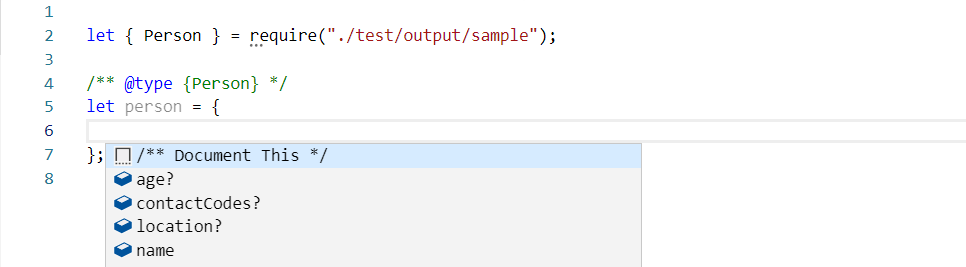
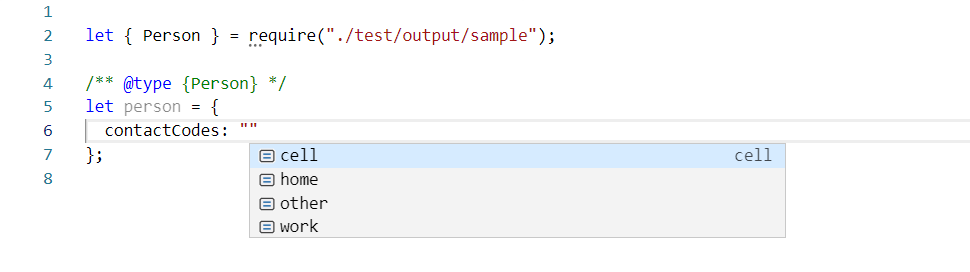

# JSON Schema to JSDoc

Generate JSDoc definitions from a JSON schema file.

[](https://travis-ci.org/cdmgtri/json-schema-to-jsdoc)
[](https://coveralls.io/github/cdmgtri/json-schema-to-jsdoc?branch=dev)

- [Installation](#installation)
- [Features](#features)
- [Usage](#usage)
  - [Example input](#example-input)
  - [Generate from node.js](#generate-from-nodejs)
  - [Generate from command line](#generate-from-command-line)
- [Output](#output)
- [Code Hinting](#code-hinting)
  - [VSCode property hints](#vscode-property-hints)
  - [VSCode enum hints](#vscode-enum-hints)

## Installation

```bash
npm install cdmgtri/json-schema-to-jsdoc
```

## Features

- Generate JSDocs for properties in a JSON Schema file.
- De-references the JSON Schema file before processing to support `$ref`.
- Generates JavaScript file with JSDoc `typedef`s and typed objects.
- Supports required and optional properties.
- Supports first-level nested properties.
- Supports JSDoc enum values (up to 30 per type).
- Supports CLI usage.

## Usage

### Example input

JSON Schema file: input.schema.json

```json
{
  "$schema": "http://json-schema.org/draft-07/schema",
  "properties": {
    "Person": {
      "type": "object",
      "description": "Information about a person",
      "properties": {
        "name": {
          "type": "string",
          "description": "A person's name"
        },
        "age": {
          "type": "integer",
          "description": "A person's age"
        },
        "location": {
          "$ref": "#/definitions/LocationType"
        },
        "contactCodes": {
          "$ref": "#/properties/ContactCodes"
        }
      },
      "required": ["name"]
    },
    "Location": {
      "$ref": "#/definitions/LocationType"
    },
    "ContactCodes": {
      "type": "string",
      "enum": ["home", "work", "cell", "other"]
    }
  },
  "definitions": {
    "LocationType": {
      "type": "object",
      "properties": {
        "street": {
          "type": "string",
          "description": "A street address"
        },
        "city": {
          "type": "string",
          "description": "A city name"
        },
        "state": {
          "type": "string",
          "enum": ["CA", "NY", "TX", "FL"],
          "description": "A state code"
        },
        "zip": {
          "type": "string",
          "description": "A zip code"
        }
      }
    }
  }
}
```

### Generate from node.js

```js
const JSONSchemaToJSDoc = require("../index");

// Arguments:
// 1. Path to JSON schema input file
// 2. Path to new JS output file with JSDoc definitions

await JSONSchemaToJSDoc.generateFile("input.schema.json", "output.js");
```

### Generate from command line

```bash
jsonschema-jsdoc input.schema.json output.js
```

## Output

JavaScript file with JSDoc `typedef`s and typed objects:

```js

/**
 * @typedef {Object} PersonType
 *
 * Information about a person
 *
 * @property {string} name - A person's name
 * @property {integer} [age] - A person's age
 * @property {object} [location] -
 * @property {string} [location.street] - A street address
 * @property {string} [location.city] - A city name
 * @property {"CA"|"NY"|"TX"|"FL"} [location.state] - A state code
 * @property {string} [location.zip] - A zip code
 * @property {"home"|"work"|"cell"|"other"} [contactCodes] -
 */

/** @type {PersonType} */
let Person = {};


/**
 * @typedef {Object} LocationType
 *
 * @property {string} [street] - A street address
 * @property {string} [city] - A city name
 * @property {"CA"|"NY"|"TX"|"FL"} [state] - A state code
 * @property {string} [zip] - A zip code
 */

/** @type {LocationType} */
let Location = {};

/**
 * @typedef {"home"|"work"|"cell"|"other"} ContactCodesType
 */

/** @type {ContactCodesType} */
let ContactCodes = {};

module.exports = { Person, Location, ContactCodes }
```

## Code Hinting

Import the typed objects and use them with JSDoc `@type` comments:

```js
const { Person } = require("output.js");

/** @type {Person} */
let person = {};
```

### VSCode property hints



### VSCode enum hints


